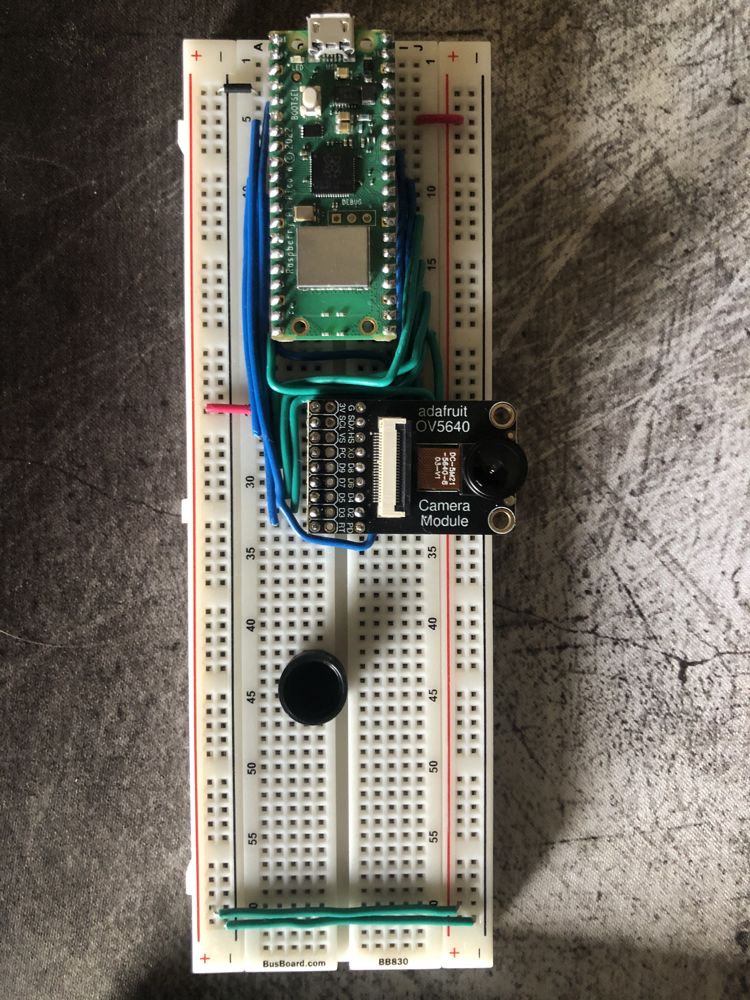

# Zero_Spy_Camera
A simple setup for streaming video over a network

## Goals:
The goal of this project was to create a simple camera streaming interface to allow for a tiny camera to be placed on various objects including a toy rc car. The video feed would be viewable by anyone on the network and could be easily mounted to see something interesting.

## What I tried:
Originally I was planning on using the OV5640 camera breakout module from adafruit connected to a raspberry pi pico w. After some testing and getting the camera working the pico lacked the bandwidth to do any video streaming over network. It barely had the storage capabilities to create a buffer for the camera. This board would be more useful when connected to a display which was not helpful for my purposes.

The next plan was to use a raspberry pi zero 2 w which had all the capabilities that I needed albeit for a much steeper price. The raspberry pi pico w's were readily available for $6 dollars while the zeros were only available at scalper prices. They retail for $15, but I paid around $100. inorder to get the zero to detect the third party camera I was using I had to create a dtoverlay for the specific hardware I was using.  

Adding `dtoverlay=ov5647` to the /boot/config.txt file enabled the camera to be detected. And installing the full libcamera package with `sudo apt-get install libcamera-apps` allowed the use of the av encoder. 

From there I tried to get video streaming over the network working. Using this command you can stream the output from the av encoder to anywhere over the network: `libcamera-vid -t 0 --codec libav --libav-format mpegts --libav-audio -o "tcp://0.0.0.0:1234?listen=1"`

With the above command it is possible to have a server listening for the data and display it on a webpage. Unfortunately, I was unable to get this working, so I looked for a simpler approach. I found that the youtube streaming platform allows for an encoder to stream video directly to their api through a stream key and this would allow me to stream video from my pi zero 2 w to anyone in the world. Unfortunately, I waited too long to signup for youtube streaming and they have a 24 hour wait period before you can start streaming. 

## Simple Demo Showing camera works: 
https://youtu.be/rIBQVOubTPE

## Zero Setup on Battery Power

## Original Attempt Pico W Setup
